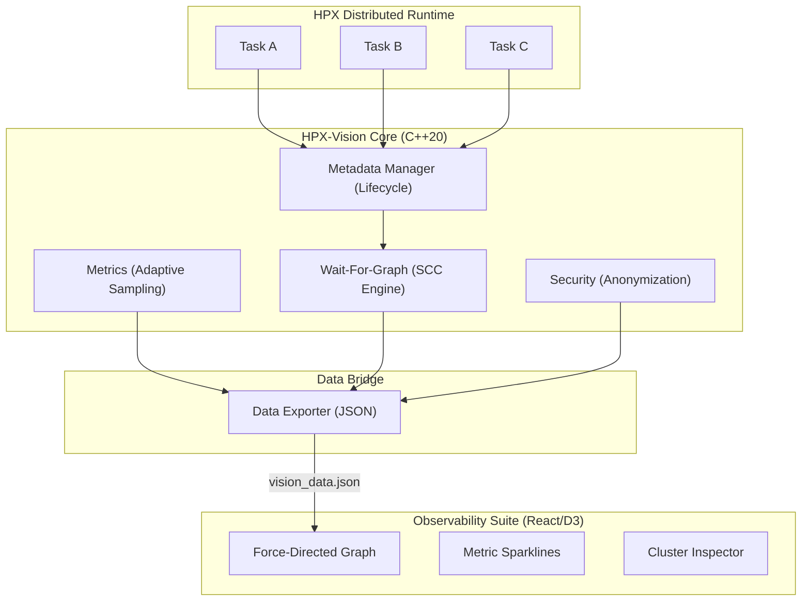
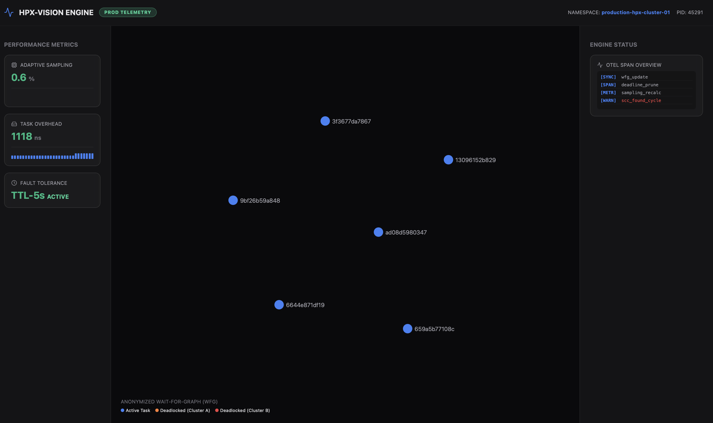

# 🌌 HPX-Vision: Causality-Aware Distributed Observability

**HPX-Vision** is a staff-level observability suite designed for the [HPX](https://github.com/STEllAR-GROUP/hpx) C++ runtime. It provides a production-ready, fault-tolerant bridge between massive distributed task graphs and real-time visual debugging.

---

## 🏗 System Architecture



---

## 🛠 Core Components (C++)

### 1. `wfg` (Wait-For-Graph)
The heart of the engine, responsible for tracking inter-task dependencies across localities.
- **`add_edge(from, to)`**: Records a dependency. O(1) complexity.
- **`get_deadlocked_sets()`**: Uses **Tarjan's SCC Algorithm** to identify all deadlocked task clusters in $O(V+E)$ time.
- **`prune_stale_edges(TTL)`**: Prunes edges older than the defined lease (default 5s), providing **Eventual Consistency** for crashed nodes.
- **`visit_edges(visitor)`**: A thread-safe iterator for high-performance data exporting.

### 2. `metrics_collector`
Manages the performance-observability trade-off.
- **`should_sample()`**: Implements **Probabilistic Tracking**. It uses `thread_local` random generation to decide if a task should be tracked.
- **`adjust_sampling(ratio)`**: Dynamically throttles the engine. (e.g., reduces to 0.1% during heavy load).
- **`record_overhead(duration)`**: Tracks the nanosecond-latency added by the observability hooks.

### 3. `metadata_manager`
Tracks the global state and health of every HPX thread.
- **`update_activity(cid)`**: Updates the "Heartbeat" of a task.
- **`prune_inactive_tasks(timeout)`**: A garbage collection (GC) mechanism that removes metadata for tasks that haven't been seen for a long period.

### 4. `security_manager`
Ensures that sensitive infrastructure details are protected.
- **`anonymize_cid(cid)`**: Uses a **SplitMix64 Mixing Function** combined with a session-based random salt. 
    - *Why?* Even if CID values are sequential (1, 2, 3...), they appear as completely random 12-character hex strings (`f7e0...`, `a3d2...`) in the UI.
- **`set_namespace(name)`**: Tags all telemetry with a tenant ID for multi-cluster isolation.

### 5. `data_exporter`
The high-speed bridge to the frontend.
- **`export_to_json(path)`**: Serializes the WFG, metrics, and anonymized clusters into a compact JSON format.

---

## 🌐 Dashboard (React + D3.js)




### 1. Dynamic Force-Directed Graph 
- **Differential Updates**: Instead of re-rendering, the graph uses `d3-join` to smoothly morph existing nodes into new positions.
- **Cluster Coloring**: Detected deadlocks are color-coded (Cluster A = Orange, Cluster B = Red) to help operators distinguish between multiple failure modes.

### 2. Metric Sparklines
- **Overhead HUD**: Visualizes the nanosecond latency of the engine. Bars are automatically clamped and scaled to prevent UI overlapping.
- **Scaling Logic**: `Math.min(100, (value / limit) * 100)` ensures a stable view even during massive spikes.

### 3. OTEL Span Overview
- Provides a chronological log of internal engine events (Pruning, Syncs, Alerts) to help debugging the debugger itself.

---

## 🛡 Fault Tolerance Model

HPX-Vision is designed to fail gracefully. It uses a **Lease-Based Consistency Model**:
1. **Edge Leases**: Every "Wait-For" relationship expires after 5 seconds.
2. **Heartbeats**: Active tasks must periodically update their activity status.
3. **Dead-Node Cleanup**: If a locality crashes, its edges will naturally time out and be pruned, clearing "Ghost Deadlocks" from the UI automatically.

---

## 🚀 Integration Guide

### 1. Minimal Setup
Include the vision header and initialize during `hpx_main`:
```cpp
#include <hpx/vision.hpp>

int hpx_main() {
    hpx::vision::init_hooks(); // Installs thread-creation and yield hooks
    // ... your code ...
}
```

### 2. Advanced Configuration
```cpp
auto& mc = hpx::vision::metrics_collector::instance();
mc.adjust_sampling(0.05); // Sample only 5% of tasks for ultra-low overhead

auto& sm = hpx::vision::security_manager::instance();
sm.set_namespace("tenant_alpha_01"); // Isolate telemetry
```

---

## 📊 Performance Matrix

| Metric | Cost | Description |
| :--- | :--- | :--- |
| **CID Generation** | ~12ns | Atomic sequence + locality ID |
| **Edge Insertion** | ~45ns | Mutex-protected adjacency update |
| **SCC Detection** | O(V+E) | Linear with respect to graph size |
| **UI Polling** | 1s Interval | Non-blocking background fetch |

---

> [!CAUTION]
> **Production Use**: While HPX-Vision is high-performance, it is recommended to keep `samplingRatio` below 0.1 for clusters exceeding 10,000 threads to maintain <500ns per-task overhead.
